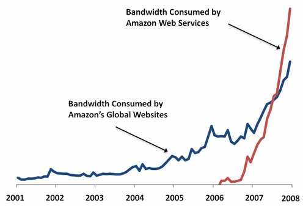
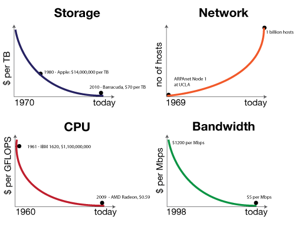

This blog post is first in a series of posts that will teach the tenants and implementations of `Reactive Programming`. We well explore the content as laid out in [Reactive Application Development](http://manning.com/devore/?a_aid=ironfish&a_bid=39e254aa) of which I co-author.

## Moths and Programming

One of the fascinating things found in nature is the ability of a **species to adapt** to its changing environment. The canonical example of this is Britain's **Peppered Moth**. When newly industrialized Great Britain became polluted in the nineteenth century, slow-growing, light-colored lichens that covered trees died and resulted in a blackening of the trees bark. The impact of this was quite profound: lightly-colored peppered moths, which historically had been well `camouflaged` and the `majority`, now found themselves the obvious target of many a hungry bird. Their `rare`, dark-colored sibling, who had been `conspicuous` before, `now blended` into their recently polluted ecosystem. As the birds, changed from eating dark-colored to light-colored moths, the previously common light-colored moth became the `minority`, and the dynamics of Britain’s moth population **changed**.

So what do moths have to do with programming? Well, moths in and of themselves are not particularly interesting in this regard, rather `how they adapted` is. The peppered moth was able to survive a new hostile environment due to a genetic mutation that allowed it to `react` to the changes around. This ability to react on-the-fly is what a **Reactive Application** is all about, an application that `reacts to its changing environment by design`. Built into its DNA is the ability to:

- React to load
- React to failure
- React to users

We achieve by the underlying notion of reacting to messages, but more on that later.

Just like the challenging environment of the Peppered Moth, today's world faces the hurdles of the `ever-growing` demands of modern computing and requires competent and efficient solution. As developers, we must be able to build applications that exhibit the ability to `react to these demands`. With user expectations of split-second performance, spikes in application load, and data expansion into the petabytes, modern applications must embrace these requirements by incorporating `reactive` behavior into their DNA.

> "It used to be said the Big Fish eats the Little Fish. This is no longer true. Today it's the Fast Fish that eats the Slow Fish."

## Principles of Reactive Applications

Sound programming principles such as `message-driven`, `elasticity`, `resilience` and `responsiveness` are the root in a reactive application’s DNA. Let’s define each of these principles, as defined in the [Reactive Manifesto](http://www.reactivemanifesto.org/), the blueprint for building reactive applications:

Message Driven
: Reacting to messages: Based on `asynchronous` communication where the design of sender and recipient are `not affected` by the means of `message propagation`. As a result, you can design your system in isolation without worrying about how the transmission of messages occurs. Message-driven communication leads to a loosely coupled design that provides scalability, resilience and responsiveness.

Elastic
: Reacting to load: The system stays `responsive` under varying `workload`. Reactive applications can `actively scale up and down` or `scale in and out` based upon `usage` or other `metrics` utilized by system designers, `saving money` on unused computing power but most importantly ensuring the servicing of growing or spiking user base.

Resilient
: Reacting to failure: The system stays `responsive` in the face of `failure`. Failure is `expected` and `embraced` and since many systems exist in isolation, a `single point of failure` remains just that. The system responds appropriately with strategies for restarting or re-provisioning, seamless to the overall systems.

Responsive
: React to users: The system `responds promptly` if at all possible. Responsiveness is the `cornerstone` of `usability` and `utility`, but more than that, responsiveness means that `problems` may be `detected quickly` and `dealt` with `effectively`.

### No Boilerplates

The reader should note that `Reactive Applications` are not `boilerplate` applications and are `challenging to build`. They are designed to react to changes in their surrounding environment without having to write new code, and that is a hefty task. Additionally they are based on a set of principles and techniques, which are `not new` but are just now becoming `mainstream`. For example, many current applications on the JVM favor frameworks like Spring or Hibernate, while `Reactive Applications` tend to favor toolkits such as `Akka`. Akka is considered both a toolkit and runtime for building highly concurrent, distributed, and resilient, message-driven applications.

Don’t let this new paradigm, with its use of robust toolkits like Akka, give you pause, however. `Reactive programming` is a very different way of building applications. By `embracing the traits` listed above, you will be able to solve the complex problems associated with distributed systems, concurrent programming, fault tolerance and more.

## Why Reactive? A Little History

Arguably one of the greatest inventions of mankind in the last 50 years has been The internet. It is origins date back to the 1960’s, when the United States government commissioned research to build a robust, fault-tolerant computer network. This work, which began with a series of memos by J.C.R. Licklider of MIT in August 1962, became known as the `Galactic Network` concept. He envisioned a globally interconnected network of computers that would allow users to access data and programs from anywhere in the world. J.C.R. Licklider was the Director of the Information Processing Techniques Office (IPTO) within the Pentagon’s ARPA, the Advanced Research Projects Agency which we know today as DARPA, the Defense Advanced Research Projects Agency.

### Distributed Computing

The result of this work in by the United States, as well as some additional work from Great Britain and France, ultimately paved the way for what we know as the Internet today. Additionally, this resulted in a new computer model called Distributed Systems which represented a shift in the computing paradigm. Prior to this, the foundational computer model was large and expensive mainframe systems affectionately referred to as `Big Iron`.

Mainframes historically represent a `centralized` computing model that focuses on `efficiency`, `local scalability`, and `reliability`. While this model is very effective, it is also expensive and out of the reach of many companies. As a result, many see `Distributed Systems` as a less costly way of achieving and `exceeding` the raw computing power that typical mainframe configurations represent. That being said distributed systems do not preclude mainframes.

### Cloud Computing

The advent of distributed systems with the continual progress towards more powerful and less expensive computing hardware paved the way to what we know today as `Cloud Computing`. Cloud computing represents another significant `paradigm shift` in how we write and manage computer applications.

While distributed systems focus on the technical details of interconnected, independent computer systems, cloud computing focuses on the `economics side` of the `equation`. It represents a departure from the norm of managing, operating and developing IT systems and provides substantial economic savings as well as greater agility and flexibility.

### Rethinking One's Value Proposition

As a result, many companies have begun to rethink their value proposition. Case and point; In January of 2008 Amazon announced that Amazon Web Services now consume more bandwidth than their entire global network of retail services, as shown in this figure from [Amazon Blogs](http://aws.amazon.com/blogs/aws/lots-of-bits/):

What is Amazon? An online bookstore or provider of Cloud Services?

This new landscape of distributed cloud computing represents a dramatic change for the modern programmer, much like the Industrial Revolution of the nineteenth century did for the Peppered moth. Recent hardware enhancement such as multi-core CPU’s and multi-socket servers provide computing capabilities that were non-existent as little as 8 years ago. The following shows the state of storage, CPU, and bandwidth compared to the number of network nodes. Notice the increase from the 70's!

As the figure from [Oreilly Radar](http://radar.oreilly.com/2011/08/building-data-startups.html) illustrates, the decrease in the cost of storage, CPU cycles, and bandwidth coupled with an increase of network nodes, means it is shaping up to be a very competitive environment. An environment the `Reactive Paradigm` is designed to meet head on because of ready distribution across this vast ocean of processing power while maintaining resilience and responsiveness.

## Until Next Time...

The best way to understand the advantages of a `Reactive Architecture` over other approaches is through a comparison example. In the next blog post, we use a construct everyone is familiar with: the web shopping cart. We will consider a simple example of a customer browsing online inventory, choosing items, and checking out. The example will compare and contrast both `monolithic` (applications where all layers are mutually dependent) and `Reactive Architectures`. We will explore how each solves the complexities we’ve just discussed, show the stark differences between the two approaches and the notable advantages of a reactive solution.
